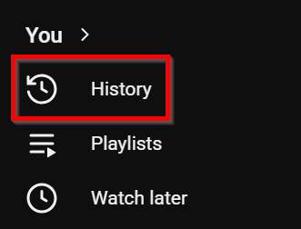
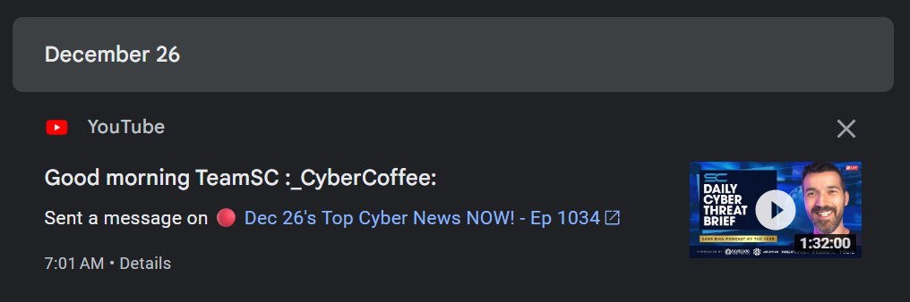
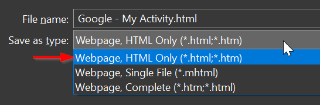

# CPE Counter for Simply Cyber: Daily Cyber Threat Brief

Watch the Daily Cyber Threat Brief from [Simply Cyber](https://www.youtube.com/@SimplyCyber).

Each episode of the Daily Cyber Threat Brief is worth half a CPE. Leaving a comment during the live stream is a great way to prove you were there.

Use this simple Python script to extract episode titles from your YouTube Live Chat history, creating a list of episodes you have viewed.

## Download Your Live Chat History

Navigate to YouTube and click on the **History** button on the left sidebar.

On the right side of the page, click on **Live Chat**. This will take you to a Google My Activity page that lists all of the videos you have left a Live Chat on.

You should see the history of your Live Chats listed on this page. Note: You may need to scroll to the bottom of the page to load more history.

Press `CTRL + S` to save the page as **Webpage, HTML Only**.

## Extract Episodes

If your downloaded Google - My Activity.html file is in the same directory as the script: `python extract_episodes_from_comments.py`

If your file is saved elsewhere, include the path: `python extract_episodes_from_comments.py "C:\path\to\activity.html`.

To export the episode list to a CSV file, run `python extract_episodes_from_comments.py --csv > episodes.csv`
